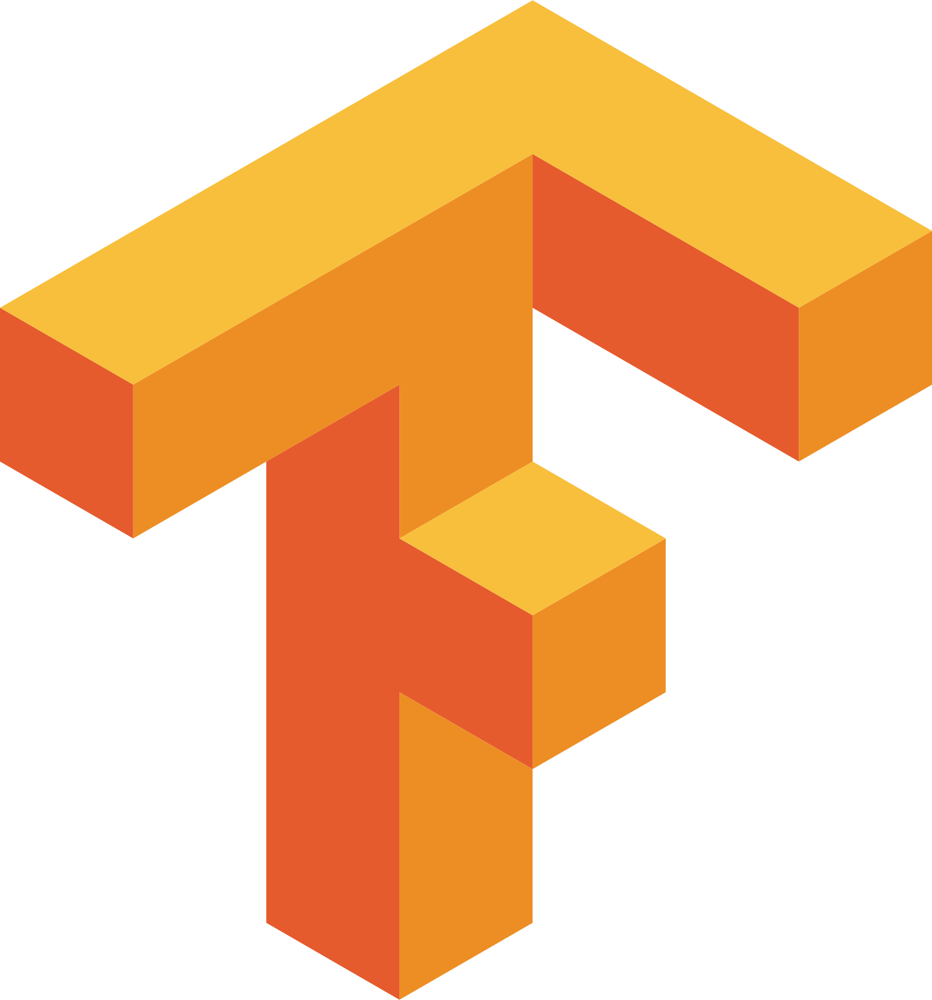

# Probabilistic Graphical Models &thinsp; 

A list of awesome resources for understanding and applying PGMs, which are a rich framework for encoding probability distributions over complex domains: joint (multivariate) distributions over large numbers of random variables that interact with each other. These representations sit at the intersection of statistics and computer science, relying on concepts from probability theory, graph algorithms, machine learning, and more. They are the basis for the state-of-the-art methods in a wide variety of applications, such as medical diagnosis, image understanding, speech recognition, natural language processing, and many, many more. They are also a foundational tool in formulating many machine learning problems.

## 📝 Publications

1. Apr 1, 2011 - [Iterative Gaussianization: from ICA to Random Rotations](https://arxiv.org/abs/1602.00229) by Laparra et. al.

   > Normalizing flows in the form of Gaussianization in an iterative format. Also shows connections to information theory.

### 🛠️ Applications

1. Aug 14, 2018 - [Analyzing Inverse Problems with Invertible Neural Networks](https://arxiv.org/abs/1808.04730) by Ardizzone et. al.

   > Normalizing flows for inverse problems.

## 🌐 Blog Posts

1. Jan 17, 2018 - [Normalizing Flows Tutorial](https://blog.evjang.com/2018/01/nf1.html) by Eric Jang.

   > [Part 1](https://blog.evjang.com/2018/01/nf1.html): Distributions and Determinants. [Part 2](https://blog.evjang.com/2018/01/nf2.html): Modern Normalizing Flows. Lots of great graphics.

1. Apr 3, 2018 - [Normalizing Flows](https://akosiorek.github.io/ml/2018/04/03/norm_flows) by Adam Kosiorek.

1. Oct 13, 2018 - [Flow-based Deep Generative Models](https://lilianweng.github.io/lil-log/2018/10/13/flow-based-deep-generative-models) by Lilian Weng.

## 📦 Packages

###  &nbsp;PyTorch Packages

1. Feb 9, 2020 - [`nflows`](https://github.com/bayesiains/nflows) by [bayesiains](https://homepages.inf.ed.ac.uk/imurray2/group)

   > A suite of most of the SOTA methods using PyTorch. From an ML group in Edinburgh. They created the current SOTA spline flows. Almost as complete as you'll find from a single repo.

###  &nbsp;TensorFlow Packages

1. [Jun 22, 2018](https://github.com/tensorflow/probability/commit/67a55b2ef5e94da203991ed102c9e41d085a840a#diff-b89d05520b0fa976a2c5c918c1114b17) - [TensorFlow Probability](https://tensorflow.org/probability)

   > Offers RNVP, MAF and other autoregressive models.

###  &nbsp;JAX Packages

1. [Mar 9, 2020](https://github.com/Information-Fusion-Lab-Umass/NuX/commit/24e9d6fe28b63ac23469982c0cddd3e0d4ed5ffd) - [`NuX`](https://github.com/Information-Fusion-Lab-Umass/NuX) by Information Fusion Labs (UMass)

   > A library that offers normalizing flows using JAX as the backend. Has some SOTA methods. They also feature a surjective flow via quantization.

2. [Mar 23, 2020](https://github.com/ChrisWaites/jax-flows/commit/9d5af75d3bf89499b279f83e7ae9a637246cd6f1) - [`jax-flows`](https://github.com/ChrisWaites/jax-flows) by [Chris Waites](https://chriswaites.com/#)

   > Another library that has normalizing flows using JAX as the backend. Has some of the SOTA methods.

## 🧑‍💻 Code

###  &nbsp;PyTorch Repos

1. Sep 1, 2018 - [`pytorch-flows`](https://github.com/ikostrikov/pytorch-flows) by Ilya Kostrikov.

   > PyTorch implementations of density estimation algorithms: MAF, RNVP, Glow.

2. Dec 30, 2018 - [`normalizing_flows`](https://github.com/kamenbliznashki/normalizing_flows) by Kamen Bliznashki.

   > Pytorch implementations of density estimation algorithms: BNAF, Glow, MAF, RealNVP, planar flows.

3. Feb 6, 2019 - [`pytorch_flows`](https://github.com/acids-ircam/pytorch_flows) by [acids-ircam](https://github.com/acids-ircam)

   > A great repo with some basic PyTorch implementations of normalizing flows from scratch.

4. Dec 9, 2019 - [`pytorch-normalizing-flows`](https://github.com/karpathy/pytorch-normalizing-flows) by Andrej Karpathy.

   > A Jupyter notebook with PyTorch implementations of the most commonly used flows: NICE, RNVP, MAF, Glow, NSF.

5. [Jul 3, 2020](https://github.com/DiffEqML/torchdyn/commit/349fbae0576a38bdb138633cfea4483706e11dd0#diff-2442d08f4c0753b452c9d2a8cd8a1a41) - [Density Estimation with Neural ODEs](https://torchdyn.readthedocs.io/en/latest/tutorials/07a_continuous_normalizing_flows.html) and [Density Estimation with FFJORDs](https://torchdyn.readthedocs.io/en/latest/tutorials/07b_ffjord.html) by [`torchdyn`](https://torchdyn.readthedocs.io)

   > Example of how to use FFJORD as a continuous normalizing flow (CNF). Based on the PyTorch suite `torchdyn` which offers continuous neural architectures.

6. July 19, 2020 - [`Normalizing Flows - Introduction (Part 1)`](https://pyro.ai/examples/normalizing_flows_i) by [pyro.ai](http://pyro.ai)

   > A tutorial about how to use the `pyro-ppl` library (based on PyTorch) to use Normalizing flows. They provide some SOTA methods including NSF and MAF. [Parts 2 and 3 coming later](https://github.com/pyro-ppl/pyro/issues/1992).

###  &nbsp;JAX Repos

1. [Jul 19, 2019](https://github.com/pyro-ppl/numpyro/commit/781baf51752e5919c358362c2ef745a3df55f709#diff-177a79ac143e3f5df6fabf6604c28559) - [`Neural Transport`](https://pyro.ai/numpyro/examples/neutra) by [numpyro](http://num.pyro.ai/en/stable)

   > Features an example of how Normalizing flows can be used to get more robust posteriors from Monte Carlo methods. Uses the `numpyro` library which is a PPL with JAX as the backend. The NF implementations include the basic ones like IAF and BNAF.

### Others

1. Jul 11, 2017 - [`normalizing_flows_overview.ipynb`](https://docs.pymc.io/notebooks/normalizing_flows_overview.html) by PyMC3.

   > A very helpful notebook showcasing how to work with flows in practice and comparing it to PyMC3's NUTS-based HMC kernel.

2. Jun 11, 2018 - [`destructive-deep-learning`](https://github.com/davidinouye/destructive-deep-learning) by [David Inouye](https://davidinouye.com)

   > An entire suite of iterative methods to normalizing flows. Includes tree-based as well as Gaussianization methods.

## 🎉 Open to Suggestions!

See something that's missing from this list? [PRs welcome!](https://github.com/janosh/awesome-normalizing-flows/edit/master/readme.md)
